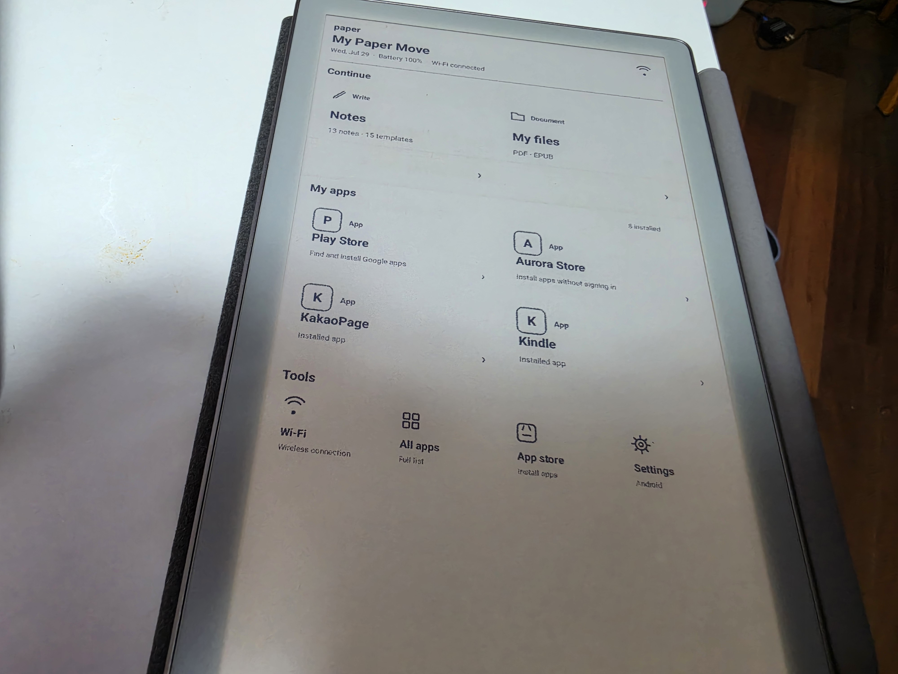
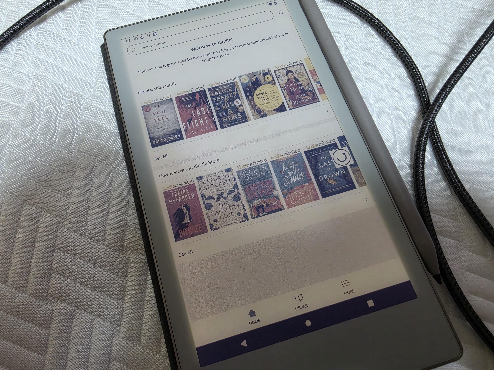

# Paper Pro Move dual-boot installer

An experimental, open-source Windows installer project for configuring a
user-owned reMarkable Paper Pro Move to dual boot:

1. the original reMarkable OS as the stock boot option; and
2. a local, E Ink-optimized Android environment in a separate boot slot.

Android runs on the device. This is not VNC, screen mirroring, or a remote
desktop.

> [!CAUTION]
> There is no public installer release yet. Do not copy the research scripts to
> a device or write a boot/root partition based on this repository. The current
> Windows tool is a non-destructive preflight only.



### Paper Home pen-response demo

https://github.com/user-attachments/assets/2a5b0b1b-a460-4bcc-af01-abbdc9b25287

[Open the repository copy](media/pen-latency-demo.mp4)

[Watch the 7-second Gallery 3 color demo](media/gallery3-demo.mp4)



## What this project is

The public deliverable is intended to be a Windows one-click installation,
recovery, and removal tool plus independently developed device-integration
source code. The goal is to make the process reproducible without distributing
a modified copy of reMarkable OS.

The project focuses on:

- preserving stock reMarkable OS as a boot choice;
- booting local Android 12 from a separate slot;
- touch, Marker, palm rejection, front light, power, Wi-Fi, and lock/wake
  integration;
- low-latency handwriting in the clean-room Paper Home note app;
- E Ink refresh modes, fast monochrome interaction, and Gallery 3 color
  settling;
- battery and standby optimization; and
- safe installation, backup, recovery, removal, and OTA handling.

## What this project is not

This repository does **not** contain or sell:

- a modified reMarkable OS or firmware image;
- reMarkable's proprietary note application, cloud integration, or code;
- Android system images or vendor firmware;
- Google Mobile Services, Play Store packages, or third-party APKs;
- signing keys, device backups, Wi-Fi credentials, or user data; or
- a tablet, software license, preorder, support contract, or guaranteed beta.

Users will be responsible for obtaining any third-party software through its
official distribution channel and for complying with its terms.

## Current device status

Validated on one Paper Pro Move prototype:

| Area | Current result |
| --- | --- |
| Boot | Stock OS remains selectable; local Android boots from the other slot |
| Display | Fast monochrome interaction and delayed Gallery 3 color settling |
| Input | Touch, palm rejection, Marker state, and Paper Home native ink path |
| Hardware | System Wi-Fi, front light, power key, lock/wake, battery reporting |
| Power | Doze/app standby tuning and safe long-idle power-off policy |
| UI | E Ink-first Paper Home with English and Korean interfaces |
| Apps | Play Store/Aurora/RIDI/Series run; Kindle and Libby cold-start |
| OTA | Immediate stock A/B overwrite is guarded, but update/restore is unfinished |

Important limitations:

- Kindle and Libby account, DRM, offline, and long-session tests are incomplete.
- Week-long Android standby equivalent to stock is not claimed.
- Native instant ink is currently specific to Paper Home Note.
- Android uses a software-rendered graphics path for complex applications.
- Widevine and hardware attestation are not available.
- One-click installation, removal, and emergency recovery are not finished.

See [Release status](docs/RELEASE-STATUS.md) for the precise support boundary.

## Repository contents

- `installer/` — non-destructive Windows preflight and installer design notes
- `src/runtime/` — local Android launch and host-side control components
- `src/input/` — touch relay and input configuration
- `src/ota/` — experimental OTA overwrite guard and status checker
- `src/paper-home/` — clean-room E Ink launcher and note UI integration layer
- `docs/` — architecture, safety, source policy, roadmap, and release status
- `media/` — device photos and short on-device pen/color demonstrations

The E Ink bridge and early boot selector are not in the first public source
snapshot because their current build depends on a device-side header boundary
that has not yet been replaced with a clearly redistributable interface.

## Windows preflight

The current Windows tool performs read-only prerequisite checks:

```powershell
Set-ExecutionPolicy -Scope Process Bypass
.\installer\Invoke-PaperMovePreflight.ps1
```

It does not install Android, modify a partition, change a boot slot, or connect
with credentials. See [installer/README.md](installer/README.md).

## Planned release gates

No installer release will be published until all of these are complete:

- idempotent install, uninstall, and emergency recovery;
- verified backup before any partition write;
- two complete stock OTA → Android restore cycles;
- measured 1-hour reading, 8-hour lock, and 24-hour shelf battery results;
- clean-room/public-header boundary for the display and boot components;
- reproducible builds and signed release checksums; and
- a small Paper Pro Move recovery-focused beta.

## Contributing and support

Read [CONTRIBUTING.md](CONTRIBUTING.md) before opening a pull request. Security
issues should follow [SECURITY.md](SECURITY.md).

Voluntary sponsorship supports testing hardware, recovery work, documentation,
and installer development:

[Sponsor the project on GitHub](https://github.com/sponsors/skdlzlvk)

Sponsorship is not a purchase or a promise of access or release timing.

## License and independence

Original source in this repository is licensed under
[GPL-3.0](LICENSE), unless a file states otherwise. See
[THIRD_PARTY-NOTICES.md](THIRD_PARTY-NOTICES.md) and
[docs/LEGAL-NOTICE.md](docs/LEGAL-NOTICE.md).

This is an independent community project. It is not affiliated with, sponsored
by, or endorsed by reMarkable. Product and service names are used only to
identify compatibility and demonstrate user-installed applications.
